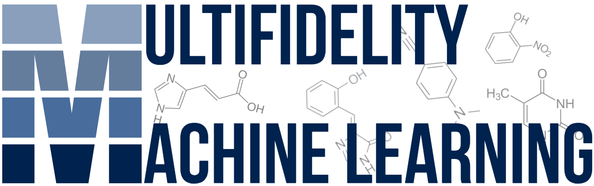

<div align="center">
<picture>
  <source media="(prefers-color-scheme: dark)" srcset="mfml_logo_dark.png">
  <source media="(prefers-color-scheme: light)" srcset="mfml_logo_light.png">
  <p align="center">
  
  </p>
</picture>
</div>

[](https://opensource.org/licenses/MIT)

MFML-4-QC is an open-source library that enables multifidelity machine learning for quantum chemical systems. While the multifidelity methods are model-architecture agnostic, this library provides a lightweight, ultra-fast Numba-compiled Kernel Ridge Regression (KRR) setup as the primary architecture. Users can seamlessly integrate their own custom ML models (e.g., from scikit-learn) and directly interface with quantum chemistry engines like ORCA and PySCF for automated data generation and active learning.

🪲 Bug Reports: If you find a bug in MFML-4-QC, or have a feature request, please open a GitHub issue.

If you use this package, please consider citing the following articles:
* TBA
* TBA

Key Features
* **Ultra-Fast Kernels:** Compute Matérn, Gaussian, Laplacian, and Wasserstein kernels efficiently using JIT-compiled C-loops via Numba.
* **In-Memory Representations:** Generate flattened Coulomb Matrices directly from .xyz trajectories without slow disk I/O.
* **Flexible ML Architectures:** Use the built-in KRR or drop in any scikit-learn compatible estimator (e.g., RandomForestRegressor, MLPRegressor).
* **Quantum Chemistry Oracles:** Abstract interfaces to automatically generate inputs, execute runs, and parse outputs from engines like ORCA and PySCF.

## Installation
**Prerequisites:**Python 3.8 or higher

### Standard Installation
To install the core package (which includes numpy, numba, tqdm, and scikit-learn), clone the repository and install it via pip:

```bash
git clone [https://github.com/vivinvinod/mfml-qc.git](https://github.com/vivinvinod/mfml-qc.git)
cd mfml-qc
pip install .
```

### Installing Optional Dependencies 
(PySCF)If you plan to use the built-in PySCFEngine oracle, you can install the package with the optional pyscf dependency. (Note: PySCF can be a heavy dependency, which is why it is kept optional).
```
pip install .[pyscf]
```

### Developer Installation
If you are modifying the package source code or want to run the unit tests, install the package in "editable" mode (-e) with the [dev] flag. This installs testing and formatting tools like pytest and black:pip install -e .[dev]

## Examples
(Examples and tutorials will be added here soon.)


